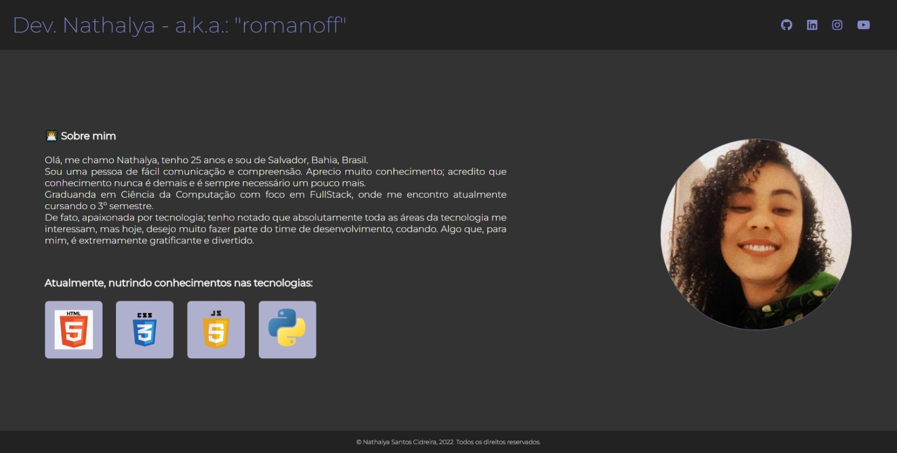

# Carta de Apresentação

> HTML5, CSS3 & JS na prática

Projeto construído durante curso de HTML5, CSS3 & JS na prática, realizado junto à Workover.

[Clique aqui para acessar](https://romanoff-97.github.io/carta-de-apresentacao/)

## Tecnologias 🛠 
- HTML
- CSS

## Contato 📧

nscidreira@hotmail.com